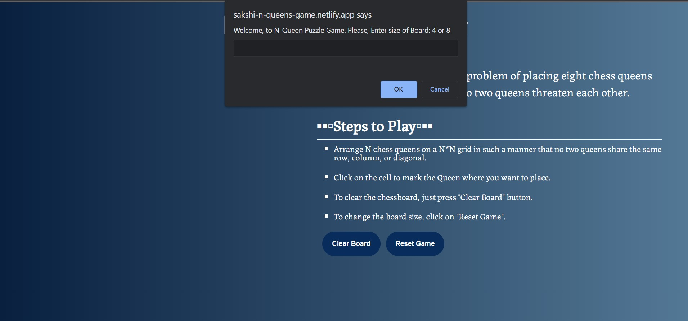
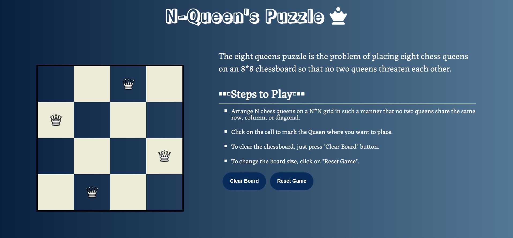
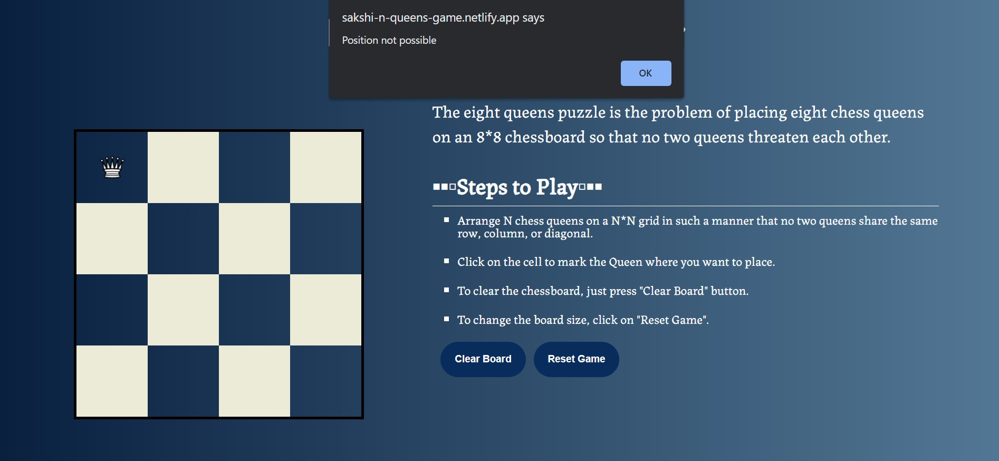
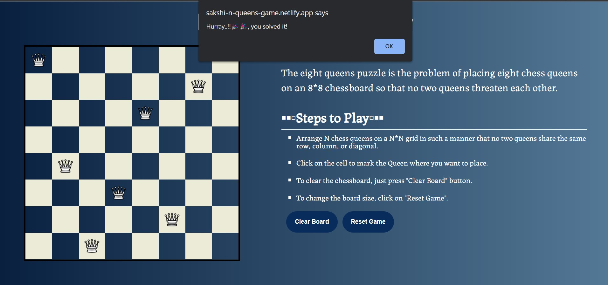

# N Queen's Puzzle Game

**About**

The eight queens puzzle is the problem of placing eight chess queens on an 8*8 chessboard so that no two queens threaten each other.

**Live Link**

https://sakshi-n-queens-game.netlify.app/

**Technologies Used:** 

**Instructions**

* Arrange N chess queens on a N*N grid in such a manner that no two queens share the same row, column, or diagonal.

* Click on the cell to mark the Queen where you want to place.

* Click on the queen to remove the queen.

* To clear the chessboard, just press "Clear Board" button.

* To change the board size, click on "Reset Game" button.

**Previews**

* Enter Grid Size

  

* Solving the Puzzle

    

* Getting the Error message

    

* Success message on solving the puzzle

    
